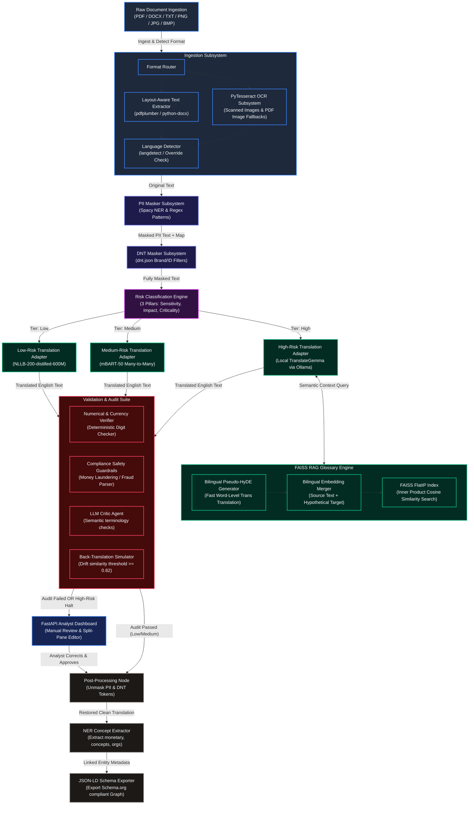
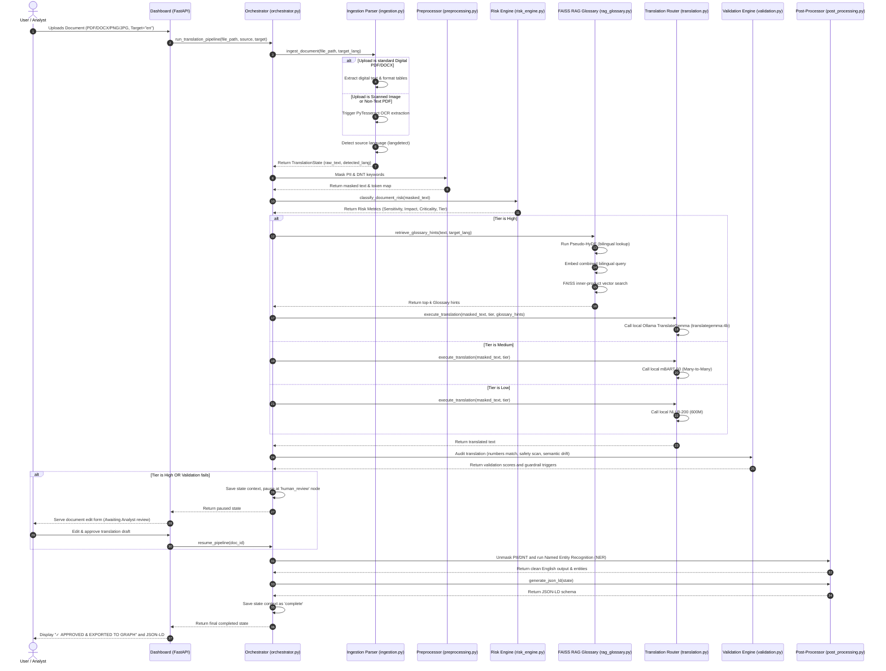

# UPDATED FUNCTIONAL DIAGRAMS & SEQUENCE MATRIX

This document contains the latest structural diagrams for the M.Tech final dissertation report, incorporating the **PyTesseract OCR Image Ingestion Subsystem** and the **FAISS RAG Bilingual Pseudo-HyDE Glossary Engine**.

---

## 1. Functional Block Diagram

---

## 2. Sequence Diagram

