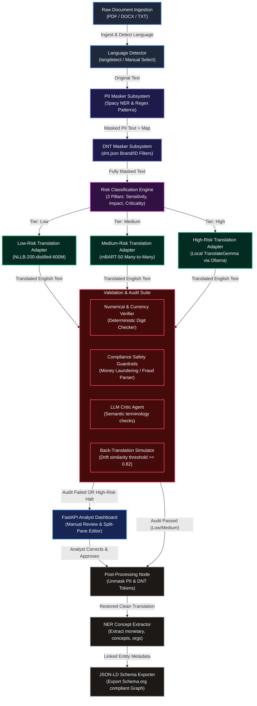
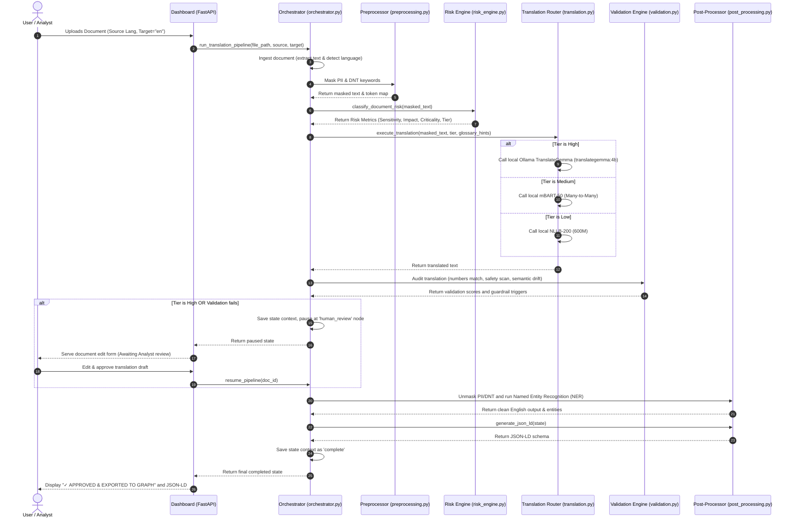

# 2. FUNCTIONAL BLOCK DIAGRAM/DESCRIPTION OF TRANSLATION FRAMEWORK

The translation and analysis framework is orchestrated as a state-based sequential processing graph. All data transitions, token mappings, risk metrics, and evaluation scores are preserved within a unified `TranslationState` checkpoint context which is serialized to a local JSON database metastore. The functional block diagram of the framework and its data paths is shown below in Figure 2.

### Figure 2: FUNCTIONAL BLOCK DIAGRAM of translation pipeline graph

### Figure 3: SEQUENCE DIAGRAM of framework execution code flow

---

### 1. SUB-SYSTEM NODE DESCRIPTIONS

#### a) File Ingestion Subsystem
This entrypoint node handles file parsing and language routing. It extracts raw unicode streams from uploaded documents while keeping structural layouts (tables, newlines, and list layouts) intact. Once the text is extracted, it calls the **Language Detection module** to determine the document's native script, routing the ISO code to the classification engine.

#### b) Preprocessing Masking Subsystem
The masking subsystem isolates critical customer identities and corporate markers prior to translation:
* **PII Masking:** Scans the text using a SpaCy NER pipeline and regular expression extractors to locate customer names, credit card numbers, email accounts, and SSNs, replacing them with formatted token tags (e.g., `__PII_EMAIL_0__`).
* **DNT (Do Not Translate) Masking:** Matches tokens against `dnt.json` definitions to catch and replace SWIFT codes, brand IDs, and IBAN formats. Both token mapping directories are saved in the database metastore to allow full reconstruction.

#### c) Risk Classification Subsystem
Evaluates the document against Sensitivity, Business Impact, and Criticality. It scans for regulatory concepts and high-value transactions (monetary figures exceeding $\$100,000$). Documents containing financial compliance triggers are immediately categorized as High-Risk to route them to the specialized TranslateGemma translation model and enforce dashboard review.

#### d) Translation Routing Subsystem
Directs document translation into English based on the assigned risk score:
* **NLLB-200-distilled-600M:** Executed for Low-Risk files, ensuring swift local translation.
* **mBART-50:** Executed for Medium-Risk files, leveraging its Seq2Seq architecture for structural contract terminology.
* **Ollama TranslateGemma (`translategemma:4b`):** Deployed for High-Risk files, delivering context-aware local translations while preserving all PII/DNT tags.

#### e) Validation & Auditing Subsystem
Performs a series of verification checks on the output translation:
* **Numerical Verifier:** Matches all numerals and currencies between source and translation.
* **Back-Translation Check:** Translates the text back to the source language using TranslateGemma and measures word-level Jaccard similarity. If the score falls below `0.82`, it triggers a dashboard review halt.
* **Safety Guardrails:** Scans translation for compliance violations (fraud, bribery, tax evasion) to alert the analyst.

#### f) Post-Processing & Exporter Subsystem
Once approved (either automatically for low/medium-risk documents or manually by the analyst), the system unmasks all tokens using the map directory, restoring the document's original names and codes. It then extracts financial Named Entities (NER) and exports the data into a standard **JSON-LD Schema** structure, allowing the translated document and its compliance metadata to be indexed into an enterprise **Knowledge Graph**.
